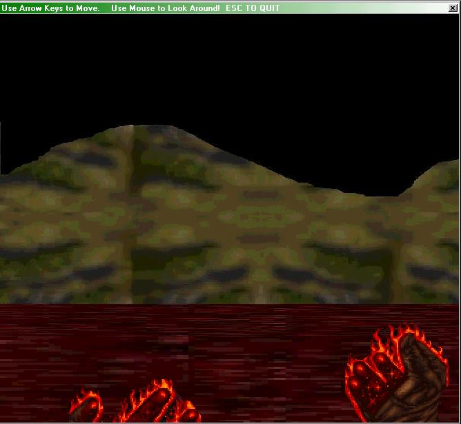



## A 3D RPG IN PURE VB\!\! NO DX\! VERY FAST\!

### Description

A 3D RPG made with PURE VB! Use the Mouse to look around, the keyboard to move! Unlimited terrain sizes! No Direct X or third-party controls. Very Fast - Tested on a P133!!! Very simple code - Anyone can understand it and every line is commented. But keep in mind this is only a draft and it will eventually be made into something much bigger. I made this in 2 hours, including the textures so please don't mind the graphics. Please download to see for yourself. And please vote!!! Thanks!
 
### More Info
 

             |
---                |---
**Submitted On**   |2000-01-06 23:50:52
**By**             |[dwin05](https://github.com/Planet-Source-Code/PSCIndex/blob/master/ByAuthor/dwin05.md)
**Level**          |Beginner
**User Rating**    |2.8 (14 globes from 5 users)
**Compatibility**  |VB 3\.0, VB 4\.0 \(16\-bit\), VB 4\.0 \(32\-bit\), VB 5\.0, VB 6\.0
**Category**       |[Games](https://github.com/Planet-Source-Code/PSCIndex/blob/master/ByCategory/games__1-38.md)
**World**          |[Visual Basic](https://github.com/Planet-Source-Code/PSCIndex/blob/master/ByWorld/visual-basic.md)
**Archive File**   |[A\_3D\_RPG\_I1866453222005\.zip](https://github.com/Planet-Source-Code/dwin05-a-3d-rpg-in-pure-vb-no-dx-very-fast__1-59565/archive/master.zip)

